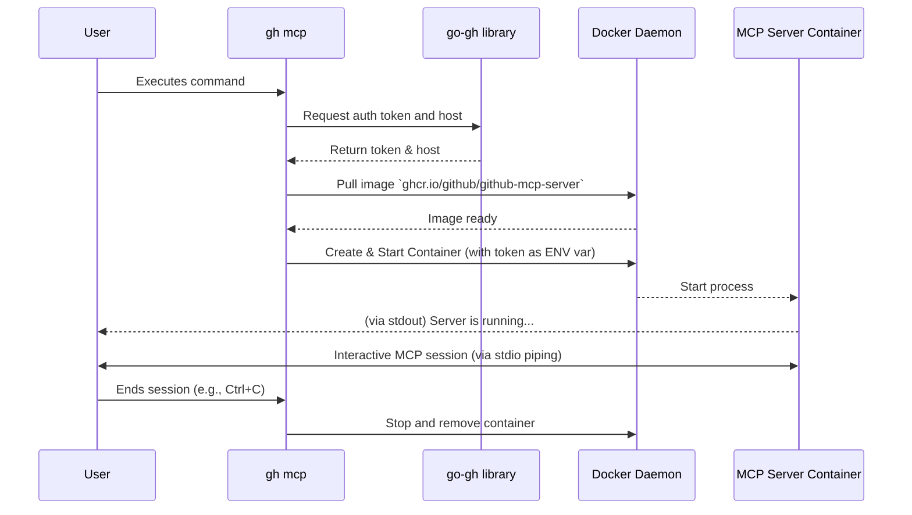

# **Project Plan: gh-mcp**

Project Name: gh-mcp  
Conductor: Gemini  
Last Updated: June 25, 2025

## **1. Objective**

To develop a gh CLI extension that seamlessly authorizes and runs the github-mcp-server in a Docker container. This extension will leverage the user's existing gh CLI authentication context, eliminating the need for manual token configuration and providing a frictionless startup experience for developers using AI agents with the Model Context Protocol (MCP).

## **2. Core Problem & Proposed Solution**

* **Problem:** Developers using AI tools that rely on github-mcp-server must manually acquire a GitHub Personal Access Token and configure the server to use it. This process is cumbersome and creates a barrier to entry. gh users, however, are already authenticated.  
* **Solution:** This extension, gh-mcp, will act as a bridge. It will programmatically retrieve the active user's gh auth token and host, and then use the Docker Go client to start the github-mcp-server container with these credentials automatically injected as environment variables. This creates a "one-command" launch experience.

## **3. High-Level Architecture**

The extension will be a self-contained Go application that orchestrates the following components:

1. **Authentication Layer (go-gh library):** Securely fetches the user's active GitHub host and OAuth token from the gh CLI's configuration.  
2. **Container Management Layer (Docker Go client):** Manages the lifecycle of the github-mcp-server Docker container. This includes:  
   * Pulling the latest image from ghcr.io.  
   * Creating and starting the container with the correct environment variables (GITHUB_PERSONAL_ACCESS_TOKEN, GITHUB_HOST).  
   * Configuring the container for interactive use (-i, --rm).  
3. **I/O Streaming:** Pipes the user's terminal stdin, stdout, and stderr directly to and from the running container, enabling seamless, interactive communication with the MCP server.

### **User Workflow Diagram**

## **4. Milestones & Task Delegation**

This project will be executed in three main milestones.

### **Milestone 1: Core Functional Prototype**

* **Goal:** Establish the end-to-end workflow of authentication, container startup, and basic I/O.  
* **Tasks:**  
  * **Task 1.1 (Setup):** Initialize the Go project structure for a gh extension. Define main package and command structure.  
  * **Task 1.2 (Auth):** Implement the logic to retrieve the GitHub host and token using the go-gh library. This should be encapsulated in a dedicated function.  
  * **Task 1.3 (Docker - Image Mgmt):** **-> Delegate to Worker A**  
    * Implement Docker client initialization.  
    * Implement a function ensureImage(ctx, client) that checks if ghcr.io/github/github-mcp-server:latest exists locally and pulls it if not. Provide feedback to the user (e.g., "Pulling image...").  
  * **Task 1.4 (Docker - Container Mgmt):** **-> Delegate to Worker B**  
    * Implement the runServerContainer(ctx, client, env) function.  
    * This function will be responsible for ContainerCreate and ContainerStart.  
    * Ensure the container configuration includes AttachStdin: true, OpenStdin: true, and HostConfig.AutoRemove: true.  
  * **Task 1.5 (I/O & Orchestration):** **-> Delegate to Conductor/Lead**  
    * Orchestrate the main application flow.  
    * Implement the call to ContainerAttach to get the HijackedResponse.  
    * Implement the I/O streaming between the user's terminal and the container's connection using goroutines for concurrent copying.  
  * **Task 1.6 (Cleanup):** **-> Delegate to Worker B**  
    * Implement the ContainerWait logic to block until the container exits.  
    * Ensure the HijackedResponse connection is closed and resources are released upon completion or error.

### **Milestone 2: User Experience and Error Handling**

* **Goal:** Make the tool robust and user-friendly.  
* **Tasks:**  
  * **Task 2.1 (UX):** **-> Delegate to Worker A**  
    * Add clear, concise logging messages for each step (e.g., "✓ Authenticated with gh", "✓ Starting server container...").  
    * Use spinners or progress indicators for long-running operations like image pulling.  
  * **Task 2.2 (Error Handling):** **-> Delegate to Worker B**  
    * Handle common failure scenarios with user-friendly error messages:  
      * Docker daemon is not running.  
      * User is not logged into gh.  
      * Image pull fails (network error, auth error for ghcr.io).  
      * Container fails to start.

### **Milestone 3: Documentation**

* **Goal:** Prepare the extension for public use.  
* **Tasks:**  
  * **Task 3.1 (Docs):** Write a comprehensive README.md including project purpose, installation instructions, and usage examples.  
